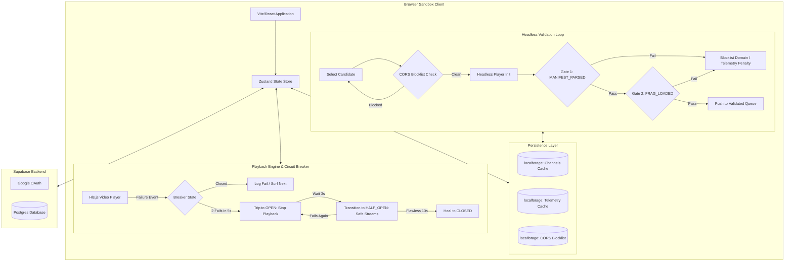

# IDKstream

<div align="center">
  
  <p><strong>An anti-algorithmic, retro-futuristic live TV surfing platform.</strong></p>
</div>

---

## Technical Architecture Overview

**IDKstream** is a client-first, serverless Progressive Web App (PWA) designed to mitigate stream playback failures and decision fatigue in internet television surfing. By combining a multi-tier headless testing pipeline, an auto-healing state machine circuit breaker, and an IndexedDB telemetry database, the application achieves a near-instantaneous "zapping" user experience across thousands of public IPTV feeds.



---

## Core System Architecture

### 1. Dual-Gate Headless Stream Validation
Traditional server-side stream validation (e.g., executing `HEAD` requests via a proxy) suffers from:
* **Server-side spoofing** (servers returning `200 OK` for geo-blocked/token-expired requests, which fail inside the player).
* **CORS policy limitations** that can only be evaluated accurately within the target browser's origin sandbox.
* **405 Method Not Allowed** responses to `HEAD` requests from media stream servers.

**IDKstream** implements a **client-side headless validation loop** that bypasses server-side checks:
* **Gate 1 (Manifest Accessibility)**: Instantiates a silent, off-screen `hls.js` instance to fetch and parse the stream manifest, waiting for the `Hls.Events.MANIFEST_PARSED` callback.
* **Gate 2 (Fragment Integrity Check)**: Simulates muted playback to trigger fragment requests. The stream is only marked "Healthy" once `Hls.Events.FRAG_LOADED` fires. This eliminates false-positives where the stream manifest is reachable, but actual video chunks are geo-blocked or protected by CORS.
* **Network Throttling & Sleep**: Validation runs on a background loop with a `600ms` delay between candidates to prevent client-side network congestion.

---

### 2. Auto-Healing State Machine Circuit Breaker
Live television sources are inherently fragile. To prevent rapid-fire cascading errors (which trigger user interface flashing or browser memory leaks), IDKstream uses a client-side circuit breaker pattern with three states:

```
[ CLOSED ] --( 2 errors in 5s )--> [ OPEN ]
   ^                                  |
   |                               ( Wait 3s )
   |                                  v
[ CLOSED ] <--( Flawless watch 10s )-- [ HALF_OPEN ]
                                      |
                                   ( Fails )
                                      v
                                   [ OPEN ]
```

* **CLOSED**: Normal operation. Playback errors are caught, penalized in local telemetry, and trigger an automated "surf" to the next stream.
* **OPEN**: Triggered if $\ge 2$ fatal playback failures occur within a rolling 5-second window. Playback is fully suspended, the screen goes dark, and a diagnostic indicator flashes.
* **HALF-OPEN**: After 3 seconds in `OPEN`, the application automatically transitions to `HALF-OPEN` and attempts to play a pre-vetted stream from `SAFE_STREAMS` (e.g., Deutsche Welle English, France 24).
  * If the fallback plays successfully for 10 seconds, the breaker heals back to `CLOSED`.
  * If it fails, the breaker trips back to `OPEN` and schedules a retry with a different fallback stream.

---

### 3. Persistent Telemetry & Weighted Random Selection
Instead of selecting next channels purely at random, the selection engine utilizes historic telemetry data stored locally via `localforage` (IndexedDB):
* **CORS Blocklist**: If a domain triggers a network CORS exception or `fragCors` error during validation, it is added to a persistent in-memory `Set` and IndexedDB table. Future validation rounds bypass these domains entirely.
* **Weighted Probability Selection**: Telemetry records track watch times, successful plays, and failed validations. Each stream is assigned a weight:
  * Verified CORS-incompatible domains: $Weight = 0$
  * Untested streams: $Weight = 50$
  * Playable, fragment-verified streams: $Weight = BaseScore + 20$ (up to a maximum of $100$)
  * Playback failures deduct $25$ points per incident.

---

### 4. Supabase Backend Integration
Cloud syncing is handled via a serverless Supabase integration:
* **Google OAuth**: Integrates with Supabase Auth to identify the client session.
* **RLS (Row Level Security)**: Bookmarks are tied to the authenticated user ID and synced with a PostgreSQL table protected by row-level policies.
* **Public Shareable Playlists**: Users can bundle their bookmarks into custom playlists. 
  * Playlists can be shared via a unique URL parameter containing a 10-character code (`?playlist=shareCode`).
  * When a user loads a shared playlist, the headless pre-warming engine dynamically shifts focus to validate only the streams within that shared playlist.

---

### 5. Retro-Futuristic CRT Shader Emulation
The visual layout features a retro television cabinet. The television screen utilizes multiple CSS layers to emulate a vintage CRT monitor:
* **Scanline Sweep**: A CSS linear-gradient animation sweeping vertically across the screen container.
* **Barrel Distortion**: Uses CSS 3D perspective transforms to create a subtle screen curvature.
* **Phosphor Bleed & Vignette**: Styled using absolute-positioned inset radial gradients and box shadows mimicking physical monitor bevel shadows and tube glow.
* **Static Noise Overlay**: Blends randomized static noise with opacity scaled dynamically based on player tuning state (e.g., higher noise during tuning, static overlay on error).
* **Audio Synthesis**: Analog dial rotations and clicking sounds are synthesized programmatically on-the-fly using the browser's **Web Audio API** oscillator nodes, avoiding heavy asset downloads.

---

## Technical Stack & Dependencies

* **Core**: React 19, TypeScript, Vite 8
* **State Management**: Zustand 5 (decoupled store architecture)
* **Styling**: Tailwind CSS 4, CSS Custom Variables
* **Database & Caching**: IndexedDB via `localforage` (for telemetry, cache management, and CORS blocklist)
* **Streaming Protocol**: `hls.js` (for HTTP Live Streaming client-side validation and playback)
* **BaaS & Authentication**: Supabase JS SDK (`@supabase/supabase-js`)
* **Utilities**: `nanoid` (for share code generation)
* **PWA Capability**: `vite-plugin-pwa`

---

## Local Development

### Prerequisites
* Node.js (v18 or higher)
* npm (v9 or higher)

### Installation
1. Clone the repository and navigate to the project directory:
   ```bash
   cd IDKstream
   ```
2. Install all dependencies:
   ```bash
   npm install
   ```
3. Configure your local environment by creating a `.env` file in the root directory (using `.env.example` as a template):
   ```env
   VITE_SUPABASE_URL=your-supabase-project-url
   VITE_SUPABASE_ANON_KEY=your-supabase-anon-key
   ```
4. Spin up the development server:
   ```bash
   npm run dev
   ```
5. Build the application for production:
   ```bash
   npm run build
   ```
